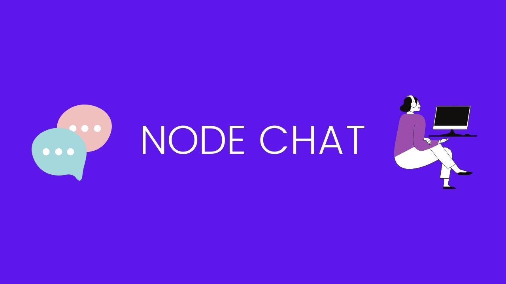

# Node Chat
## plataforma básica para troca de mensagens
Projeto base no [canal rocketseat](https://www.youtube.com/watch?v=-jXfKDYJJvo)
1. Motivação
    - Continuar o aprendizado da linguagem JS
    - Aprender um pouco sobre websocket e real time
2. Tecnologias e frameworks 
    - NodeJS
    - Html e Css
    - Jquery
    - Socket Io
    - Express

### Executando o projeto
1. Você vai precisar ter instalado o Node e o Yarn em sua máquina
    - Caso não tenha consulte a documentação do [NodeJS](https://nodejs.org/en/) e [Yarn](https://yarnpkg.com/)
2. Com o ambiente pronto basta efeutar o git clone desse repositorio e entrar no diretorio dele
    - Dentro do diretorio execute o comando `yarn` para que sejam instaladas todas as dependencias do projeto.
    - Aguarde a finalização do processo e execute `node server.js` para iniciar o servidor
Pronto ! basta acessar `http://localhost:3000`

